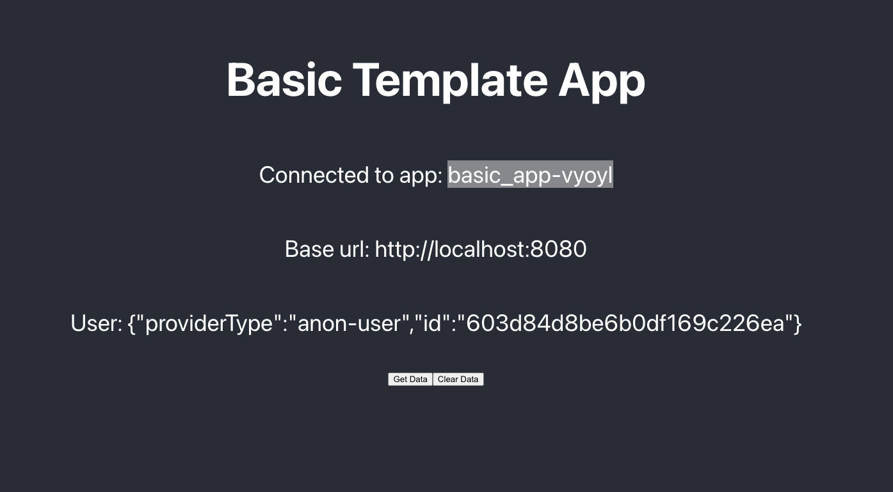

## Basic Realm App Template

This is a repository that holds a very simple realm app

The structure of this repository will emulate that of the final template apps to come

## Local Setup

1. Create a new realm app in whatever environment you're working in (local, dev, qa, staging, prod)
2. Enable Anonymous authentication
3. `cd` in `reactjs/` directory
4. Create a new file called `realm_config.json` in `reactjs/src/utils/`
5. Copy and paste the following snippet into this newly created `realm_config.json` file
6. Copy app id from newly created app in web ui and update `realm_config.json` with the correct app-id and realm server environment url
7. Install node dependencies: `yarn add` or `npm install`
8. Start webpack server: `yarn start` or `npm start`
9. Visit http://localhost:3000 to see the template app

```json
{
  "app_id": "<paste your app id here>",
  "url": "http://localhost:8080"
}
```

When set up correctly, it should look like this:


